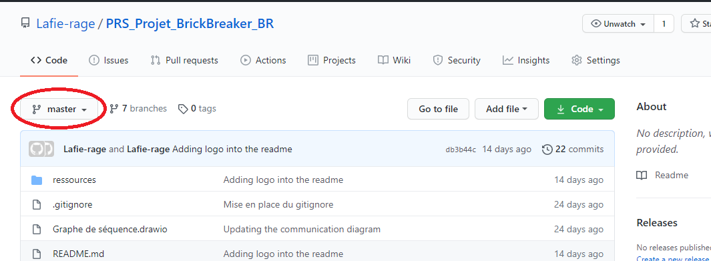
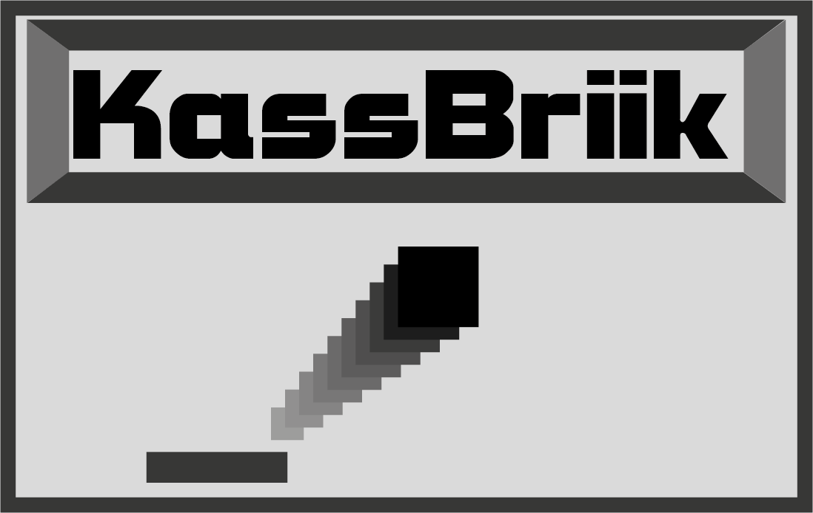

# KassBrIIk

## Introduction

A highschool project during our third year in information technology school.

The goal was to make a multiplayer game and also make it as simple as possible to use in order to let anyone downloading it and enjoying playing or coding.

This game will **only run on linux** at the moment.  
Feel free to help us if you want to make it runnable on any other OS.

A french version of this README is avaiblabe [here](README.fr.md).

## Retrieving the project

### Getting the sources to play

If you only want to play the game, first be sure your on the master branch.  
This is shown there :

You can now simply download the zip archive by clicking on "**Code**" then "**Download ZIP**".  
You will only have to extract the files from the archive where you want the game to be.

To run the game, check out the "__Build game__" section.

### Getting the source to play and help in the development

If you also want to help us in the development, be sure you have Git on your computer.  
If not check out [this link](https://git-scm.com/book/en/v2/Getting-Started-Installing-Git) that will explain you how to install it.

Now you have git, you can browse to the folder in which you want to

## Bringing up the project

# This is a Heading h1
## This is a Heading h2
###### This is a Heading h6

## Emphasis

*This text will be italic*  
_This will also be italic_

**This text will be bold**  
__This will also be bold__

_You **can** combine them_

## Lists

### Unordered

* Item 1
* Item 2
  * Item 2a
  * Item 2b

### Ordered

1. Item 1
1. Item 2
1. Item 3
   1. Item 3a
   1. Item 3b

## Images

## Links

You may be using [Markdown Live Preview](https://markdownlivepreview.com/).

## Blockquotes

> Markdown is a lightweight markup language with plain-text-formatting syntax, created in 2004 by John Gruber with Aaron Swartz.
>
>> Markdown is often used to format readme files, for writing messages in online discussion forums, and to create rich text using a plain text editor.

## Developer

[Valentin Guiberteau](https://github.com/ValentinIG2I)  
[Corentin Destrez](https://github.com/Lafie-rage)

