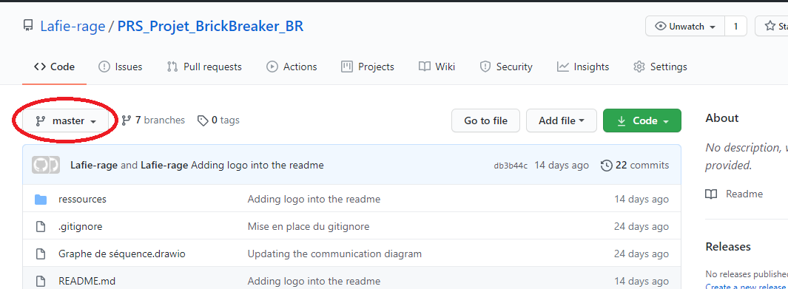

# KassBrIIk


## Introduction

Ce repository contient l'un de nos projet de 3ème année en école d'ingénieur informatique et industriel.

Le but était de créer un jeu multijoueur et le rendre aussi simple que possible afin que n'importe qui puisse le télécharger et y jouer sans soucis ou même continuer de le développer.

**Attention** : ce jeu ne fonctionnera **uniquement sous système d'exploitation vasé sur Linux** pour l'instant. Il ne fonctionnera pas sous Windows et n'a pas été testé sous Mac OS.
Si vous souhaitez nous aider à le rendre cross-plateforme, n'hésitez pas. :)

## Prérequis

Il n'y a pas beaucoup de prerequis pour suivre ses instructions hormis savoir ouvrir une console linux (ctrl+alt+t sous Ubuntu) et savoir lire les info des commandes données.
Pour ce dernier, voici quelques rappels :
* **#** : signifie que la commande doit être exécuté entant que root.
* **$** : signifie que la commande peut être exécuté en utilisateur normal.
* **user:/path/to/folder $** : signifie que vous êtes l'utilsateur __user__ et que vous vous trouver dans le dossier dont le chemin est __/path/to/folder__. En général, ce n'est pas précisé, si ça l'est, c'est que c'est important d'être cet utilisateur dans ce répertoire.
Lorsque le répertoire n'est pas donné c'est que vous devez être dans le dossier du jeu.
* **~** : signifie le répertoire "home" de l'utilsateur. En général /home/<user> avec __<user>__ le nom de l'utilsateur.

## Récupérer le projet

### Récupérer les sources pour jouer simplement

Si vous ne souhaitez pas faire plus qu'y jouer, placer vous sur la branche "master".
Vous pouvez vérifier que vous êtes sur la bonne branche de cette manière :

Vous pouvez ensuite simplement télécharger l'archive zip du des sources en cliquant sur "**Code**" puis sur "**Download ZIP**".
Ensuite vous n'aurez plus qu'à extraire les fichier de l'archive.
Pour faire ceci sous Linux, vous pouvez ouvrir l'archive en double cliquant dessus. Ceci vous permettra d'ouvrir le gestionaire d'archive.
Il ne vous restera plus qu'à cliquer sur extraire (en haut à gauche) et choisir où vous voulez placer le dossier extrait.

Pour simplement jouer, passer directement à la partie "__Compiler et lancer le jeu__"

### Récupérer les sources pour jouer ou aider au développement


Si vous voulez également prendre par au développement du jeu, il vous faudra d'abord avoir git d'installer sur votre pc ! :)
Pour ceci, vous pouvez utiliser la commande suivante :
```
$ sudo apt-cache search git | grep -E "^git"
```
Si vous n'avez aucun retour avec cette commande, c'est qu'il n'est pas installer.
Pour l'installer aller visiter [ce site](https://git-scm.com/book/en/v2/Getting-Started-Installing-Git), il vous expliquera comment faire qu'importe votre plateforme.

Déplacer vous ensuite dans le dossier dans lequel vous souhaitez placer le projet (en console ou en graphique).
Puis ouvrez une console à cet endroit si ce n'est pas déjà le cas et tapez :
```
$ git init
$ git remote add origin https://github.com/Lafie-rage/PRS-LA1
$ git pull origin master
```

Vous avez maintenant la branche __master__ du projet.
Vous pouvez également télécharger d'autres branches comme ceci en remplacant __<nomDeLaBranche>__ par la branche que vous souhaitez récupérer :

```
$ git fectch origin
$ git checkout <nomDeLaBranche>
```

Si vous souhaitez nous aidez dans le développement et que vous ne connaissez pas Git, je vous conseilles d'aller voir quelques cours d'explications comme [celui-ci](https://openclassrooms.com/fr/courses/5641721-utilisez-git-et-github-pour-vos-projets-de-developpement).


## Compiler et lancer le jeu

### Jouer seul

Afin de jouer seul il vous faudra simplement lancer un client et le serveur.
Pour ceci, vous devrez d'abord compiler chacun des executables. Pour ceci, ouvrez une console dans le répertoire du jeu et tapez-ceci :
```
$ make
```
Puis ensuite, vous pourrez lancer le jeu en laçant le serveur puis le jeu en tapant ceci toujours dans la même console (remplacer __<votrePseudo>__ par le pseudo que vous voulez avoir dans la partie :
```
$ ./build/server 1
$ client <votrePseudo>
```

### Jouer à plusieurs sur des machines différentes

Afin de jouer à plusieurs, vous devrez nécessairement passer par plusieurs machines. En effet, il n'a pas été rendu possible d'utiliser le même clavier pour jouer à plusieurs sur une machine.  
Comme pour jouer seul, voici les commandes à exécuter dans le répertoire du jeu :  
```
# ./creating_players_accounts.sh
$ make
```
La première commande doit être lancé entant que root. Elle permet de créer le compte joueur appelé "player".
Cette utilisateur est restreint. Pour plus de détails sur les utilisateurs restraint, tapez la commande suivante :
```
$ man rbash
```

Le compte "player" a comme mot de passe "player".


#### Mise en place du serveur SSH

##### Installation du serveur SSH

Si vous n'avez jamais installer de serveur SSH, voici la marche à suivre.
Si vous êtes sous Ubuntu/Debian ça se passe [ici](https://doc.ubuntu-fr.org/ssh#installation_du_serveur_ssh).
Pour les autres distributions Linux, je vous invite à vous renseigner sur le net. :)

##### Configuration du serveur SSH

Pour la configuration du serveur SSH, je vous conseil dans un premier temps de sauvegarder la configuration actuel de votre serveur si jamais vous vouliez la réutiliser.
Pour ceci :
```
# ./set_up_config_server_ssh.sh
# service sshd restart
$ cd /home/player
$ su player
player:~ $ ssh-keygen -t rsa
```

#### Lancer la partie

Pour lancer la partie à plusieurs, le fonctionnement est similaire à celui pour les parties seul a l'exception de la connexion par SSH.

##### Connaitre l'IP du serveur

Avant de vous connecter par ssh sur le serveur, il vous faudra connaître son IP.
Pour que tout fonctionne, il vous faudra être sur le même réseau (par exemple, sur la même box internet).
Pour connaître l'ip du serveur, utiliser la commande suivante sur votre pc serveur en remplacement __[interface]__ par l'interface réseau utilisé si vous la connaissez :
```
$ ifconfig [interface]
```
En général, votre ip sera du type 192.168.x.x (avec x un nombre entre 0 et 255).
Sous Ubuntu, vous pouvez aussi utiliser :
```
$ hostname -I
```
Cette commande vous donnera directement l'ensemble de vos adresses IP.

Si vous avez plusieurs adresses, vous pouvez effectuer la même commande sur un pc client se trouvant sur le même réseau. Son seul le chiffre après le dernier '.' devrait avoir changé.
Par exemple:
IP serveur : 192.168.1.1
IP client : 192.168.1.2

Si vous n'êtes toujours pas sûr, depuis un client essayer de ping les IP du serveur jusqu'à ce qu'un des ping vous donne une réponse. Vous pouvez faire ceci de cette manière (en remplace __<ipServer>__ par une des IP du serveur):
```
$ ping <ipServer>
```

##### Vérifier la présence du client SSH

Lorsque vous connaissez l'IP du serveur, vous pouvez vous connecter via le client SSH.
Normalement, sous Linux, vous pourrez exécuter la commande ssh.
Pour vérifier ceci, exécutez la commande :
```
$ ssh
```
Vous devriez obtenir un message vous décrivant le format de la commande ssh.

##### Installer le client SSH

###### Sous Linux

Si vous n'avez pas le client SSH, installer le par exemple à l'aide de
```
# apt install ssh
```
###### sous Windows

Si vous êtes sur windows, il vous faudra installer putty. Ne maitrisant pas entièrement le sujet, nous vous invitons à vous rendre sur :
* [ce lien pour les Windows 32 bits](https://the.earth.li/~sgtatham/putty/latest/w32/putty-0.74-installer.msi)
* [ce lien pour les Windows 64 bits](https://the.earth.li/~sgtatham/putty/latest/w64/putty-64bit-0.74-installer.msi)
Et pour la connexion, renseignez vous sur internet.

###### Sous Mac OS

N'utilisant pas Mac OS, nous vous invitons à vous rendre sur des forums parlant de se sujet. Vous avez probablement le client SSH par défaut.

##### Connexion au serveur via SSH sous Linux

Utilisez la commande suivant en rempalce __<ipServeur>__ par l'ip du serveur :
```
$ ssh player@<ipServeur>
```
Vous devriez avoir un message vous demandant d'enregistrer la clé RSA, vous pouvez répondre __yes__ à ce message.
Ensuite entrez le mot de passe **player** lorsqu'il vous est demandé.

##### Lancer le serveur

Avant de lancer les clients, il faudra que le serveur soit lancé.
Sur le serveur exécuté la commande suivante en remplace __<nombreDeJoueur>__ par le nombre de joueur dans la partie :
```
$ ./build/server <nombreDeJoueur>
```

##### Lancer un client

Pour lancer le client, depuis la connexion SSH en remplaçant __<pseudo>__ par votre pseudo dans la partie :
```
player@<ipServeur>: ~$ client <pseudo>
```

Pour le faire depuis le serveur (sur une console différente que celle du serveur), de la même manière :
```
$ client <pseudo>
```
ou
```
$ ./build/client <pseudo>
```

## Règles du jeu

Le but du jeu est de **casser le mur de brique** (représentée par des *B*) à l'aide de la balle (représentée par *o*).

Pour ceci, vous devrez **faire rebondir la balle** sur la raquette (représentée par une ligne de *~*), les murs ou les briques à détruire.

Chaque fois que la balle touchera un obstacle, elle rebondira selon un angle à **45 degrés** dont la direction sera changé comme ceci:
* Depuis le haut gauche :


* Depuis le haut droite :


* Depuis le bas gauche :


* Depuis le bas droite :


Chaque brique cassée raporte **1 points**.
Dans une partie normale il y a **152 briques**.

Chaque fois que la balle touche la partie sous la raquette, vous perdez **une vie**.
Vous disposez de **3 vies**.
Chaque vie perdue **divise vos points par deux en tronquant le résultat**.

## Contrôle du jeu

* *'q'* déplace la raquette à gauche.
* *'d'* déplace la raquette à droite.
* *'p'* interrompt ou reprend la partie.
* *'o'* accélère la partie. L'accélération n'est utile que lors que l'on active la raquette infinie afin de tester les maps. En effet, puisque nous ne faisont que des angles à 45° la plus part des configurations de map ne sont pas finissables.
* *'i'* active la raquette infinie. Comme dit précédemment, cette option est utilisé pour tester les patternes de maps.
* *'c'* arrête/abandonne la partie.

## Information sur le développement

Le développement a été fait par [Corentin Destrez](https://github.com/Lafie-rage) et [Valentin Guiberteau](https://github.com/ValentinIG2I) dans le cadre du projet de PRS de LA1 en 2020/2021.

Cette partie détaillera les choix d'implémentation, le protocole de communication Client/Serveur.

### La grille du jeu

En raison de l'utilisation de configuration de la tty en raw et sans écho (les raisons seront expliquée par la suite), nous avons des affichages parfois chaotique, le jeu est donc réglé pour être joué dans une console à taille par défaut sous Ubuntu (80x24).

La grille de jeu est un tableau 2D de char faisant 80x20 et de deux lignes d'affichages d'informations sur la partie.
Le tableau est composé de différents char:
* *' '* pour les casses vides
* *'W'* pour les murs
* *'B'* pour les briques
* *'~'* pour la raquette
* *'o'* pour la balle
* *'R'* pour les erreurs de caractères
* *'E'* lors du replacement de la balle après une mort

Chacun de ses caractères est affiché identiquement à l'écran à l'exception de *'E'* qui est remplacé par *' '* à l'écran puisque ce caractère sert à replacée la balle sur la raquette.

L'intégralité des informations se trouvent dans des structures (ball_t, brick_t, ...).
Plus de détailles se trouvent dans la documentation créée à l'aide de doxygen.

### Affichage et récupération des saisis clavier

La partie graphique du jeu repose sur un rafraichissement constant de l'affichage de la grille à l'écran sur un premier thread et un second thread qui attend la saisi d'un caractère par l'utilisateur pour réagir.

Il y a plusieurs possibilités de réactions en fonction de la touche saisie:
* *'q'* déplace la raquette à gauche.
* *'d'* déplace la raquette à droite.
* *'p'* interrompt ou reprend la partie.
* *'o'* accélère la partie. L'accélération n'est utile que lors que l'on active la raquette infinie afin de tester les maps. En effet, puisque nous ne faisont que des angles à 45° la plus part des configurations de map ne sont pas finissables.
* *'i'* active la raquette infinie. Comme dit précédemment, cette option est utilisé pour tester les patternes de maps.
* *'c'* arrête/abandonne la partie.

### Communication entre le serveur et le client

#### Choix du protocole de communication

Notre choix a été de prendre un protocole type TCP. C'est à dire qu'à chaque requête envoyé par le serveur (resp. le client), le client (resp. le serveur) envoit une réponse pour confirmer sa réception et son traitement.

### Diagramme de séquence

En bleu, ce sont les communications par boîte aux lettres.
En rouge ce sont les communications par la mémoire partagée.


La connexion par SSH n'est pas obligatoire puisqu'on peut également jouer depuis le PC serveur.

La séquence de communication type est donc la suivante :
1. A son lancement, le serveur attent les messages des clients sur la boîte aux lettres. Il sait combien de clients doivent se connecter puisque cette information lui est envoyé en paramètre.
1. A son lancement, le client envoit un message comportant le nom du joueur et son PID. C'est données sont stockée dans une structure contenant la liste des clients avec leur PID, le nom du joueur et une place pour son futur score.
1. Lorsque tous les clients attendus se sont connectés au serveur, ce dernier envoit un message à chaque client pour lui dire de lancer la partie.
1. Le client envoit un message pour confirmer que la partie s'est lancée puis lance la partie.
1. Lorsque la partie d'un client est terminé, un message est envoyé via la boîte aux lettres au serveur. Ce message contient le score des joueurs.
1. Le serveur attent la réception de chaque score et les stock dans la liste des clients.
1. Le serveur écrit le score dans la mémoire partagée.
1. Le serveur envoit un message à chaque client via la boite aux lettres pour leur dire que les scores sont écrit.
1. Les clients lisent les scores 1 à 1. Les accès concurents sont gérés par un sémpahore.
1. Le client répond au serveur lorsqu'il a lu le score puis l'affiche à l'écran.

### Structure des fichiers sources

Le code est répartit entre différents fichiers.
Il y a une librairie global au client et au serveur : kassbriik.h/.c.
Les executables et les libraires qu'ils utilisent sont :
* client : game_ui.h/.c.
* server : server_kassbriik.h/.c.

Des scripts bash servant à la configuration sont également disponibles :
* creating_players_accounts.sh : Création et configuration du compte "player" qui est restreint (utilisation du rbash).
* move_client.sh : Déplace l'executable dans le dossier /bin/ afin d'être appelé comme une commande. Il ajoute le r au mode du fichier afin que le bit SUID soit utilisable depuis le rbash. Ce fichier est executé par défaut à la compilation du client à l'aide du makefile.
* set_up_config_server_ssh.sh : Remplace le fichier de configuration de sshd par la configuration du jeu. Stock l'ancienne configuration(si elle existe) dans le dossier "OLD_SSH_SERVER_CONFIG" à la racine du projet. Ce dossier disposera de différents dossiers "versionX".

Le dossier offre aussi un fichier makefile permettant la compilation du projet par différents cibles. L'ensemble des executable compilée se trouvent dans le dossier build qui est créé lors de l'appel de n'importe quel cible hormis clean.

Détails des cibles
* all : Compile le serveur et le client puis lance le script move_client.sh
* client et build/client : Compilent le client seulement puis lance le script move_client.sh
* server et build/server : Compilent le serveur seulement
* build/server_kassbriik.a : Compile et créé la librairie du serveur seulement
* build/server_kassbriik.o : Compile la librairis du serveur seulement
* build/game_ui.a : Compile et créé la librairie de l'interface graphique du jeu seulement.
* build/game_ui.o : Compile la librairie de l'interface graphique du jeu seulement.
* build/kassbriik.a : Compile et créé la librairie commune au serveur et au client.
* build/kassbriik.o : Compile la librairie commune au serveur et au client.
* build : Créé le dossier build
* move_client : Lance le script move_client.sh
* clean : vide le dossier build

## Developer

[Corentin Destrez](https://github.com/Lafie-rage)

[Valentin Guiberteau](https://github.com/ValentinIG2I)


