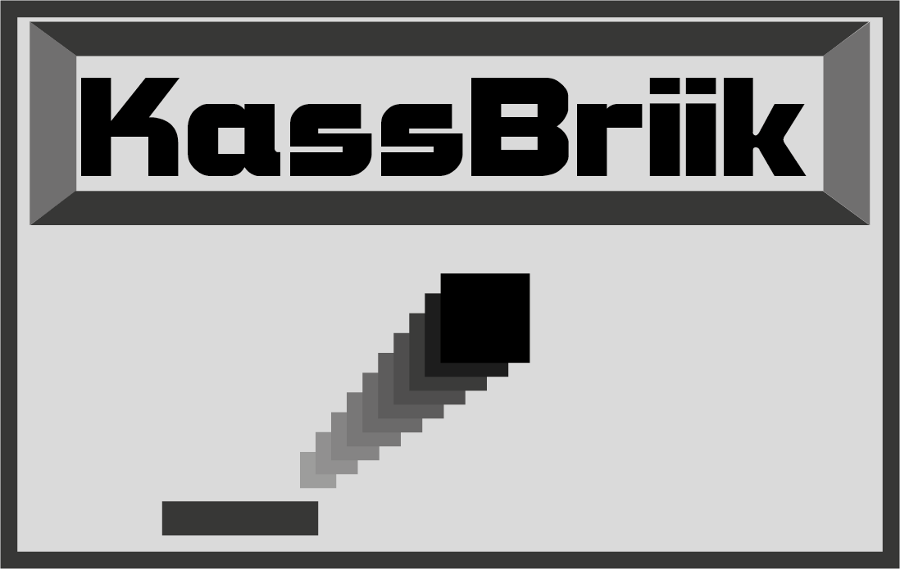

# KassBrIIk


## Introduction

Ce repository contient l'un de nos projet de 3ème année en école d'ingénieur informatique et industriel.

Le but était de créer un jeu multijoueur et le rendre aussi simple que possible afin que n'importe qui puisse le télécharger et y jouer sans soucis ou même continuer de le développer.

**Attention** : ce jeu ne fonctionnera **uniquement sous Linux** pour l'instant.
Si vous souhaitez nous aider à le rendre cross-plateforme, n'hésitez pas. :)

## Récupérer le projet

### Récupérer les sources pour jouer simplement

Si vous ne souhaitez pas faire plus qu'y jouer, placer vous sur la branche "master".
Vous pouvez vérifier que vous êtes sur la bonne branche de cette manière :

Vous pouvez ensuite simplement télécharger l'archive zip du des sources en cliquant sur "**Code**" puis sur "**Download ZIP**".
Ensuite vous n'aurez plus qu'à extraire les fichier de l'archive.
Pour faire ceci sous Linux, vous pouvez ouvrir l'archive en double cliquant dessus. Ceci vous permettra d'ouvrir le gestionaire d'archive.
Il ne vous restera plus qu'à cliquer sur extraire (en haut à gauche) et choisir où vous voulez placer le dossier extrait.

Pour lancer le jeu, regarder la partie "__Compiler et lancer le jeu__"

### Récupérer les sources pour jouer ou aider au développement


Si vous voulez également prendre par au développement du jeu, il vous faudra d'abord avoir git d'installer sur votre pc ! :)
Pour ceci, vous pouvez utiliser la commande suivante :
```sh
$ sudo apt-cache search git | grep -E "^git"
```
Si vous n'avez aucun retour avec cette commande, c'est qu'il n'est pas installer.
Pour l'installer aller visiter [ce site](https://git-scm.com/book/en/v2/Getting-Started-Installing-Git), il vous expliquera comment faire qu'importe votre plateforme.

Déplacer vous ensuite dans le dossier dans lequel vous souhaitez placer le projet (en console ou en graphique).
Puis ouvrez une console à cet endroit si ce n'est pas déjà le cas et tapez :
```sh
$ git init
$ git remote add origin https://github.com/Lafie-rage/PRS-LA1
$ git pull origin master
```

Vous avez maintenant la branche __master__ du projet.
Vous pouvez également télécharger d'autres branches comme ceci en remplacant __<nomDeLaBranche>__ par la branche que vous souhaitez récupérer :

```sh
$ git checkout -b <nomDeLaBranche>
$ git pull origin <nomDeLaBranche>
```

Si vous souhaitez nous aidez dans le développement et que vous ne connaissez pas Git, je vous conseilles d'aller voir quelques cours d'explications comme [celui-ci](https://openclassrooms.com/fr/courses/5641721-utilisez-git-et-github-pour-vos-projets-de-developpement).


## Compiler et lancer le jeu

### Jouer seul

Afin de jouer seul il vous faudra simplement lancer un client et le serveur.
Pour ceci, vous devrez d'abord compiler chacun des executables. Pour ceci, ouvrez une console dans le répertoire du jeu et tapez-ceci :
```sh
$ make single_player
```
Puis ensuite, vous pourrez lancer le jeu en laçant le serveur puis le jeu en tapant ceci toujours dans la même console :
```sh
$ ./server 1
$ ./client.sh single
```

### Jouer à plusieurs sur des machines différentes

Afin de jouer à plusieurs, vous devrez nécessairement passer par plusieurs machines. En effet, il n'a pas été rendu possible d'utiliser le même clavier pour jouer à plusieurs sur une machine.  
Comme pour jouer seul, voici les commandes à exécuter dans le répertoire du jeu :  
```sh
$ make multiplayer
```
Il vous faudra ensuite configurer un service ssh et créer des comptes, voici la démarche à suivre.

#### Créaction des comptes utilisateurs
```sh
# ./creating_players_accounts.sh
$ ./move_client.sh
$ ./update_client_sh.sh
```

#### Mise en place du serveur SSH

##### Installation du serveur SSH

Si vous n'avez jamais installer de serveur SSH, voici la marche à suivre.
Si vous êtes sous Ubuntu/Debian ça se passe [ici](https://doc.ubuntu-fr.org/ssh#installation_du_serveur_ssh).
Pour les autres distributions Linux, je vous invite à vous renseigner sur le net. :)

##### Configuration du serveur SSH

Pour la configuration du serveur SSH, je vous conseil dans un premier temps de sauvegarder la configuration actuel de votre serveur si jamais vous vouliez la réutiliser.
Pour ceci :
```sh
# cp /etc/ssh/sshd.config <dossierDeSauvegarde>
# cp /etc/ssh/sshd.config.d <dossierDeSauvegarde>
```


# This is a Heading h1
## This is a Heading h2
###### This is a Heading h6

## Emphasis

*This text will be italic*  
_This will also be italic_

**This text will be bold**  
__This will also be bold__

_You **can** combine them_

## Lists

### Unordered

* Item 1
* Item 2
  * Item 2a
  * Item 2b

### Ordered

1. Item 1
1. Item 2
1. Item 3
   1. Item 3a
   1. Item 3b

## Images

## Links

You may be using [Markdown Live Preview](https://markdownlivepreview.com/).

## Blockquotes

> Markdown is a lightweight markup language with plain-text-formatting syntax, created in 2004 by John Gruber with Aaron Swartz.
>
>> Markdown is often used to format readme files, for writing messages in online discussion forums, and to create rich text using a plain text editor.


## Developer

[Valentin Guiberteau](https://github.com/ValentinIG2I)  
[Corentin Destrez](https://github.com/Lafie-rage)


